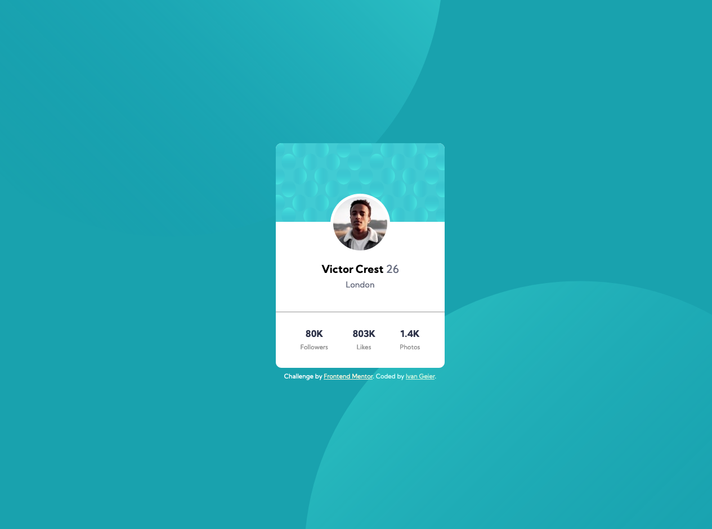

# Frontend Mentor - Profile card component solution

This is a solution to the [Profile card component challenge on Frontend Mentor](https://www.frontendmentor.io/challenges/profile-card-component-cfArpWshJ). Frontend Mentor challenges help you improve your coding skills by building realistic projects. 

## Table of contents

- [Overview](#overview)
  - [The challenge](#the-challenge)
  - [Screenshot](#screenshot)
  - [Links](#links)
- [My process](#my-process)
  - [Built with](#built-with)
  - [What I learned](#what-i-learned)
- [Author](#author)
## Overview
### The challenge

Users should be able to:

- View the optimal layout depending on their device's screen size

### Screenshot

### Links

- Live Site URL: [Check here](https://kind-haibt-c2fd7c.netlify.app)

### Built with

- Semantic HTML5 markup
- CSS custom properties
- Position Relative and Absolute

### What I learned

This challenge help me to improve my habiliteis relative and absolute position (circles in the background). 

## Author

- Ivan Geier - [@ivangeier](https://github.com/ivangeier)
- Frontend Mentor - [@ivangeier](https://www.frontendmentor.io/profile/ivangeier)
- Twitter - [@ivangeier](https://www.twitter.com/ivangeier)